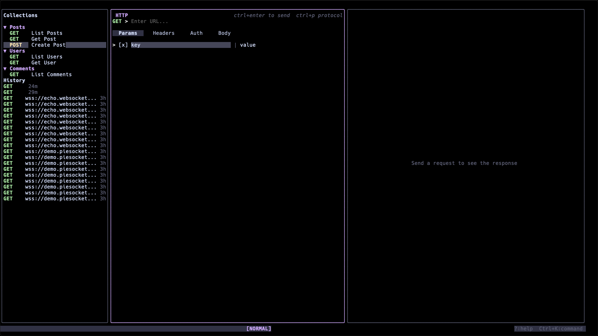

<h1 align="center">gottp</h1>
<p align="center"><strong>API client for your terminal.</strong><br>HTTP, GraphQL, WebSocket, and gRPC — all from a single TUI.</p>

<p align="center">
  <a href="https://github.com/sadopc/gottp/releases/latest"></a>
  
  
  <a href="https://github.com/sadopc/gottp/releases"></a>
</p>

<p align="center">
  
</p>

---

## Install

```bash
brew install sadopc/tap/gottp          # Homebrew (macOS/Linux)
go install github.com/sadopc/gottp/cmd/gottp@latest   # Go
```

Or download a binary from the [latest release](https://github.com/sadopc/gottp/releases/latest).

## Quick Start

```bash
gottp                                  # launch TUI (auto-discovers .gottp.yaml in cwd)
gottp --collection my-api.gottp.yaml   # open a specific collection
gottp run api.gottp.yaml --env Prod    # headless run (CI-friendly)
gottp mock api.gottp.yaml --port 8080  # start a mock server
```

## Features

| | |
|---|---|
| **4 protocols** | HTTP, GraphQL (subscriptions, introspection), WebSocket, gRPC (reflection, streaming) |
| **Vim-style editing** | Normal / Insert / Jump / Search modes, `j`/`k` nav, `f` jump-to-label |
| **7 auth methods** | Basic, Bearer, API Key, OAuth2 (PKCE), AWS SigV4, Digest, None |
| **Environments** | `{{variable}}` interpolation, `Ctrl+E` to switch, AES-256-GCM encrypted secrets |
| **Scripting** | Pre/post-request JavaScript (ES5.1+) — mutate requests, assert responses, chain variables |
| **Import/Export** | cURL, Postman, Insomnia, OpenAPI 3.0, HAR — auto-detected on import |
| **Code generation** | Go, Python, JavaScript, cURL, Ruby, Java, Rust, PHP |
| **Response diffing** | Set a baseline, compare with Myers diff (line + word-level highlighting) |
| **Performance timing** | DNS, TCP, TLS, TTFB, Transfer breakdown per request |
| **Mock server** | `gottp mock` with configurable latency, error rates, and CORS |
| **Workflows** | Chain requests with variable extraction between steps |
| **8+ themes** | Catppuccin (4 variants), Nord, Dracula, Gruvbox, Tokyo Night, or bring your own YAML |

## CLI Commands

```
gottp                    TUI mode (default)
gottp run                Run requests headless (--output json|junit, --workflow, --perf-baseline)
gottp mock               Start mock server from collection
gottp init               Scaffold a new collection
gottp validate           Validate collection/environment YAML
gottp fmt                Format and normalize collection files
gottp import             Import from file (auto-detects format)
gottp export             Export to cURL or HAR
gottp completion         Shell completions (bash, zsh, fish)
```

<details>
<summary><strong>Key Bindings</strong></summary>

### Global

| Key | Action |
|-----|--------|
| `Ctrl+Enter` | Send request |
| `S` | Send request (normal mode) |
| `Ctrl+K` | Command palette |
| `Ctrl+P` | Switch protocol |
| `Ctrl+E` | Switch environment |
| `Ctrl+N` / `Ctrl+W` | New / close tab |
| `Ctrl+S` | Save request |
| `Tab` / `Shift+Tab` | Cycle panel focus |
| `[` / `]` | Previous / next tab |
| `f` | Jump mode |
| `E` | Edit body in `$EDITOR` |
| `?` | Help |

### Sidebar

| Key | Action |
|-----|--------|
| `b` | Toggle sidebar |
| `j` / `k` | Navigate |
| `Enter` | Open request |
| `/` | Search |

### Editor

| Key | Action |
|-----|--------|
| `i` | Insert mode |
| `Esc` | Normal mode |
| `h` / `l` | Switch sub-tab |
| `1`-`6` | Jump to sub-tab |

### Response

| Key | Action |
|-----|--------|
| `j` / `k` | Scroll |
| `1`-`6` | Switch tab (Body, Headers, Cookies, Timing, Diff, Console) |
| `/` or `Ctrl+F` | Search body |
| `n` / `N` | Next / prev match |
| `w` | Toggle word wrap |

</details>

<details>
<summary><strong>Collection Format</strong></summary>

Collections are stored as readable `.gottp.yaml` files:

```yaml
name: My API
version: "1"
items:
  - folder:
      name: Users
      items:
        - request:
            name: List Users
            method: GET
            url: "{{base_url}}/users"
            headers:
              - { key: Accept, value: application/json, enabled: true }
        - request:
            name: Create User
            method: POST
            url: "{{base_url}}/users"
            body:
              type: json
              content: '{"name": "test"}'
```

Environment files (`environments.yaml`) sit alongside the collection:

```yaml
environments:
  - name: Development
    variables:
      base_url: "http://localhost:3000"
      api_key: "dev-key-123"
  - name: Production
    variables:
      base_url: "https://api.example.com"
      api_key: "prod-key-456"
```

</details>

<details>
<summary><strong>Scripting API</strong></summary>

Pre-scripts can mutate the request; post-scripts assert on the response. Each runs in a fresh JS runtime with a 5s timeout.

```javascript
// Pre-script
gottp.request.setHeader("X-Request-ID", gottp.uuid());

// Post-script
gottp.test("Status is 200", function() {
  gottp.assert(gottp.response.statusCode === 200);
});
gottp.setEnvVar("token", JSON.parse(gottp.response.body).token);
```

| Function | Description |
|----------|-------------|
| `gottp.setEnvVar(key, val)` / `getEnvVar(key)` | Read/write environment variables |
| `gottp.test(name, fn)` / `assert(cond, msg)` | Test assertions |
| `gottp.log(...)` | Log to script console |
| `gottp.uuid()` | UUID v4 |
| `gottp.timestamp()` / `timestampMs()` | Unix timestamps |
| `gottp.randomInt(min, max)` | Random integer |
| `gottp.base64encode` / `base64decode` | Base64 |
| `gottp.sha256` / `md5` / `hmacSha256` | Hashing |
| `gottp.sleep(ms)` | Sleep (max 10s) |
| `gottp.readFile(path)` | Read file from disk |

</details>

<details>
<summary><strong>Configuration</strong></summary>

`~/.config/gottp/config.yaml`:

```yaml
theme: catppuccin-mocha
vim_mode: true
default_timeout: 30s
editor: ""              # defaults to $EDITOR
script_timeout: 5s
proxy_url: ""           # HTTP/HTTPS/SOCKS5
no_proxy: "localhost"
tls:
  cert_file: ""
  key_file: ""
  ca_file: ""
  insecure_skip_verify: false
```

Custom themes go in `~/.config/gottp/themes/` as YAML files.

</details>

## License

[MIT](LICENSE)
